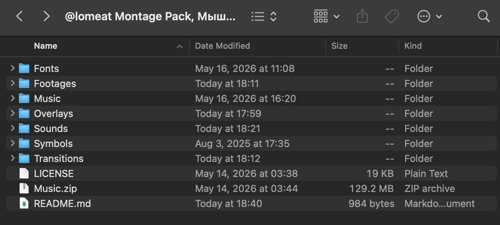
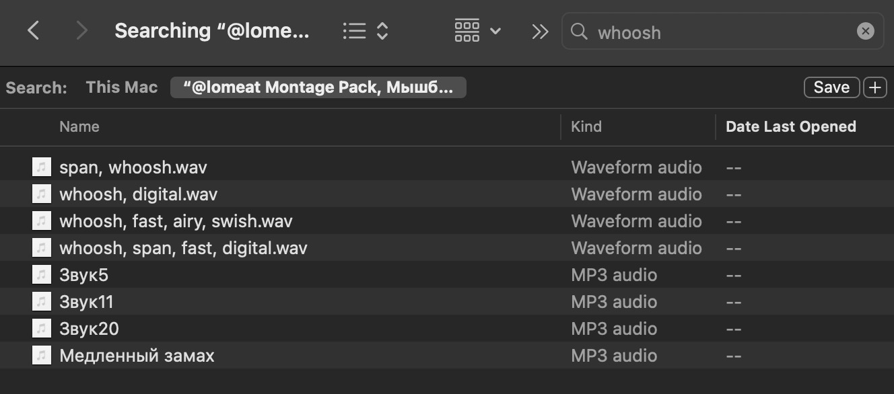
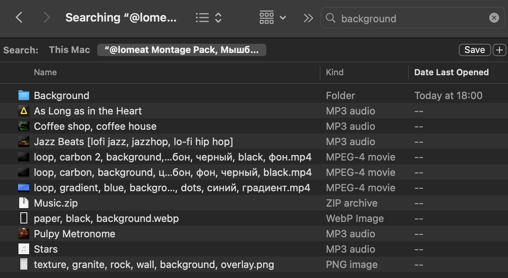

# Пак монтажера от Мышб (@lomeat)

> Уникальная система тегов для быстрого поиска по ассоциациям

> И вся трендовая музыка! (читай в конце)

Я: https://t.me/lomeat \
Новости пака и блог: https://t.me/miko_note \
Портфолио: https://t.me/lomeat_edit

---

Я устал от вечного хаоса во всех паках, свободно распространяемых в сети для монтажа, поэтому этот решает эту проблему засчет:

- во-первых логичная структура папок и файлов
- во-вторых каждый отсортирован вручную
- **самое главное**: каждый ресурс переименован по системе `тегов`

## Содержание

[Как это работает](#как-это-работает) \
[Музыка](#музыка) \
[Важное уточнение](#важное-уточнение) \
[Структура](#структура)

## Как это работает

У тебя открыта папка самого пака _(или ты добавил ее целиком в Davinci Resolve в Power Bins и открыл там)_



Ты нажимаешь на поиск и пишешь, например, `whoosh`



У тебя есть все звуки `whoosh` из пака

Но запрос может быть и сложнее, например, тебе нужно поставить что-то на фон, музыку, звуки или буквально сам "фон". Тогда ты пишешь `background`



Вуаля! Помимо футажей (видео), которые ты можешь использовать как фон в своих видео, ты также получаешь музыку, которую хорошо использовать для фона

### Примечание

На моих скринах видно, что не у всех файлов теговые название — это **баг** поиска на MacOS, визуально может быть так, но на самом деле названия изменены и при поиске учитываются. Вне режима поиска все отображается как нужно.

## Музыка

В пакет нет музыки, где взять?

Вот тут на [Google Drive](https://drive.google.com/file/d/1XDDXGER64kOntTm-fVtGP6Ob9kVQdO1E/view?usp=drive_link)

Скачиваешь и распоковываешь ее в пак. На GitHub нельзя распространять как лицензированную музыку, так и в целом заливать большие файлы (<100мб).

Я **вручную нашел и собрал** все трендовые треки рилсов, тиктоков и тд на протяжении последних лет. Есть также плейлист на [Яндекс Музыке](https://music.yandex.ru/playlists/950d84c2-dd50-cbc0-82d3-7245b49bc52b?utm_source=web&utm_medium=copy_link), просто там не все.

## Важное уточнение

### Язык (eng и рус)

Пак **почти** полностью на английском языке. **Почти**, потому что некоторые папки, связанные с чувствами и эмоциями, также имеют русские слова — для того, чтобы не ломать себе голову, как это по-английски, когда ищешь эмодзи по ассоциации **болезни, тошноты** и тд. Никто не будет писать **vomit** или **sick**, потому что большинство не знает таких слов по-английски, поэтому здесь ты встретишь у некоторых ресурсов русские теги тоже.

Однако, все остальные названы только по-английски, потому что так повелось, что весь IT и виртуальный мир крутится вокруг международного английского языка и базовые вещи, такие как `whoosh, riser, goon, swish` и тд — не переводятся на русский. Тут, будьте бобры, изучите базу. Впрочем на примере пака разберетесь.

### Некоторые файлы (эмодзи) не открываются

Да, оказалось, что на Windows формат файлов HEVC (Alpha) недоступен и есть только на MacOS.

Что делать?

Конвертировать с помощью ffmpeg в формат webm, который доступен на винде\
`ffmpeg -i input.mov -c:v libvpx-vp9 -pix_fmt yuva420p -c:a libopus output.webm`
где `input.mov` какой-то недоступный файл и `output.webm` название нового файла. \
У меня на на данный момент нет времени заниматься конвертацией всех файлов под винду, отложу это на потом.

## Структура

```
@lomeat
├── Transitions ------------------  переходы для наложения
├── Sounds -----------------------  универсальные звуки, короче SFX
├── Overlays ---------------------  наложения, текстуры
├── Music ------------------------  трендовая музыка
├── Misc/
│   ├── Symbols ------------------  символы на любой вкус
│   ├── Subscribe ----------------  анимации подписок
│   ├── Stickers (eng, pyc) ------  анимированные стикеры на любой вкус
│   └── Emoji Alpha (eng, pyc) ---  анимированные желтые эмодзи с альфа каналом
├── Fonts ------------------------  трендовые шрифты
├── Backgrounds ------------------  фоны для твоих видео
└── Ambient ----------------------  главный инструмент погружения
```
